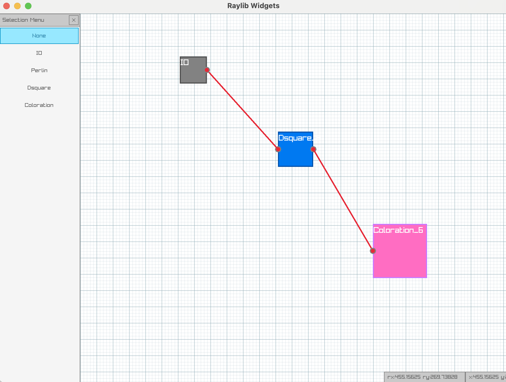
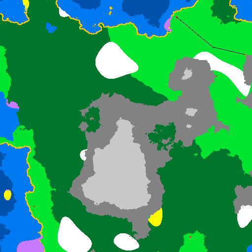
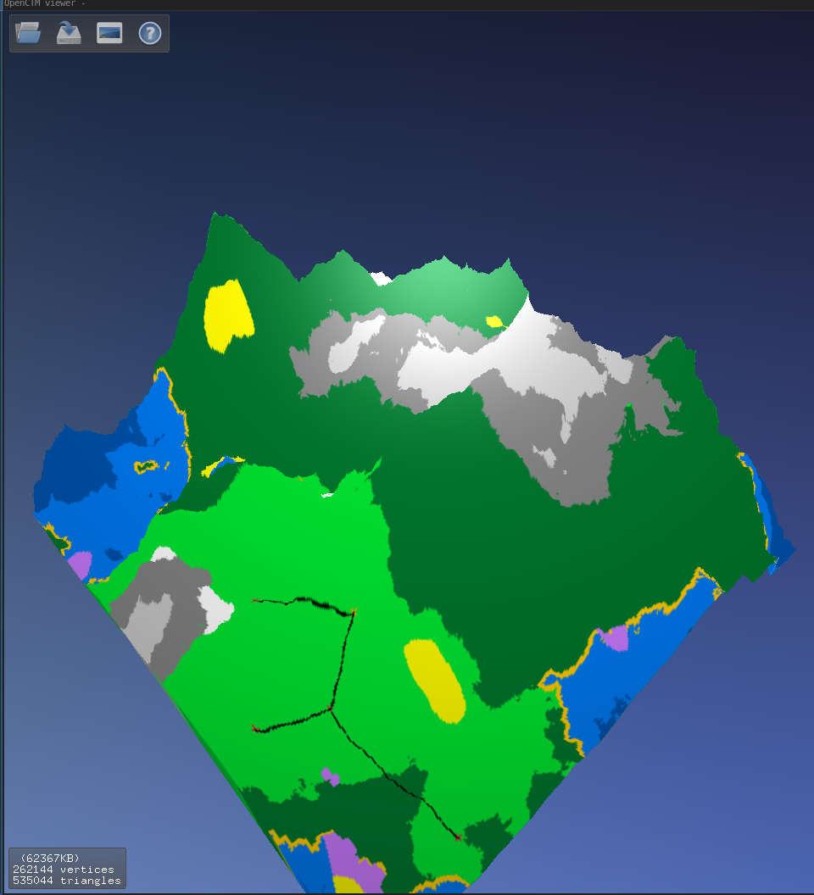

# PympMyMap - Procedural Map Generator

PympMyMap is a Rust-based project that procedurally generates maps using various algorithms such as Perlin Noise, Diamond Square, and Coloration. This project provides an interactive UI where you can configure, compile, and download your generated maps in different formats.

## Features

- **Procedural Generation**: Create maps using advanced algorithms:
  - **Perlin Noise**: Generate natural-looking terrain.
  - **Diamond Square**: Create fractal landscapes.
  - **Coloration**: Apply color schemes to enhance map visualization.
- **Interactive UI**: Choose base cases (ID) and algorithms to generate your map.
- **Multiple Output Formats**:
  - **PNG**: Press F3 to download the generated map as a PNG image.
  - **OBJ**: Press F4 to download the map as an OBJ file, suitable for 3D visualization.
- **Customizable Parameters**: Modify algorithm parameters to highlight various patterns and achieve unique map designs.

## Getting Started

### Prerequisites

- [Rust](https://www.rust-lang.org/) and Cargo must be installed on your system.

### Build and Run

To build and run the project, open your terminal and execute:

```bash
cargo run --bin ui
```

This command will launch the user interface where you can:

### Test

Select a base case (ID) for your map.
Choose the algorithms (Perlin, Diamond Square, and Coloration) to generate the map.
Adjust algorithm parameters to customize the outcome.
After configuring your settings:

Press F5 to compile the selected cases.
Press F3 to download and preview the map in PNG format.
Press F4 to download the final map in OBJ format for 3D visualization.

Go to see your PNG

Example :







